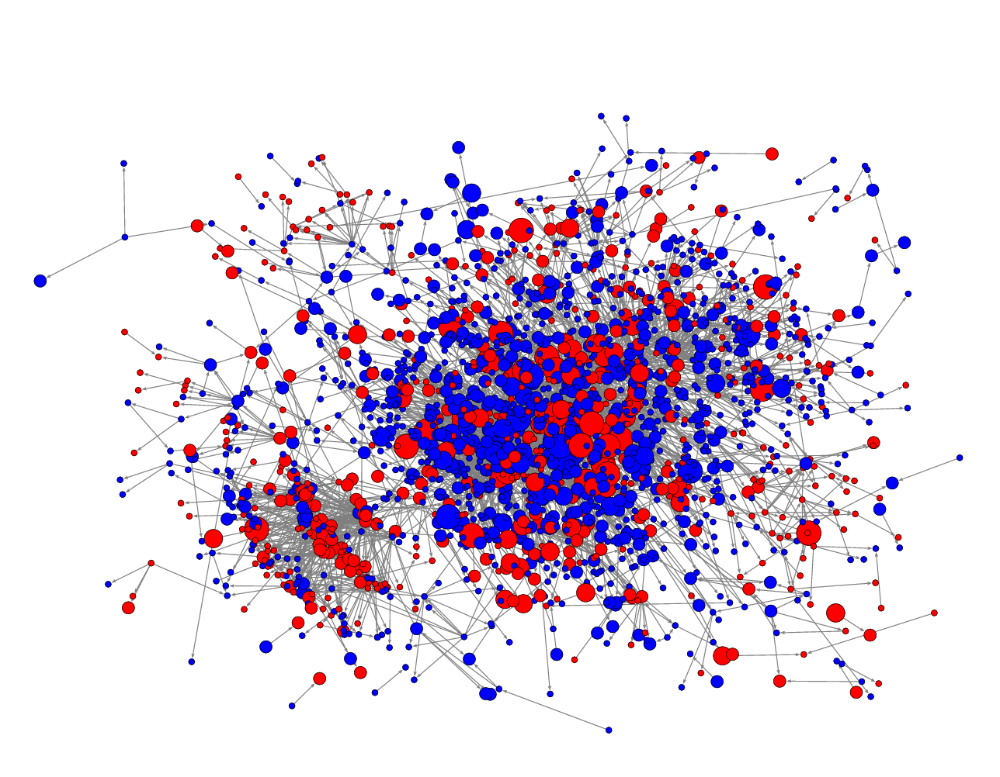

Hi 👋, welcome to my homepage. I'm **Javad**, a BSc Computer Engineering 💻 student at [Amirkabir University of Technology](https://aut.ac.ir/en) 🎓 (Tehran Polytechnic). Currently, I am a research assistant at DSLab under the supervision of Doctor [Mostafa H. Chehreghani](https://sites.google.com/site/mostafahchehreghani/home). My **research interests** encompass various areas at the intersection of artificial intelligence  and software engineering:

    

      <li>Graph Neural Networks</li>
      <li>Natural Language Processing</li>
      <li>Information Retrieval</li>
    

    

      <li>Recommender Systems</li>
      <li>Cloud Computing</li>
      <li>AutoML</li>
    

